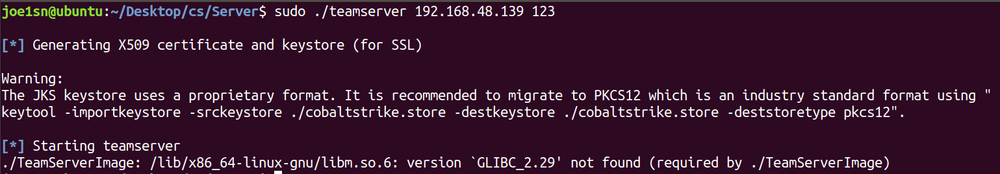
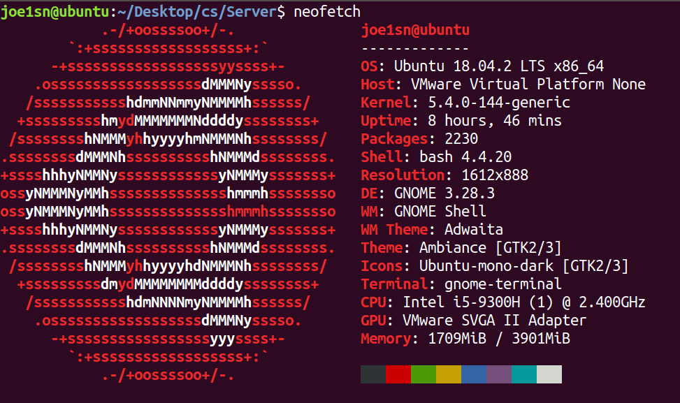
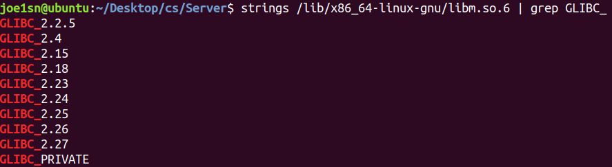
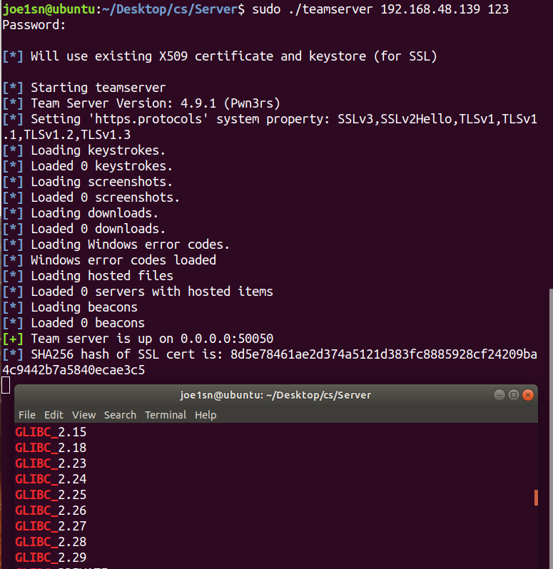

# glib_stroke
cobaltstrike 4.9缺少Glibc 2.29报错的辅助安装脚本

**免责声明：** 本工具仅供教育和反破解研究的使用。开发者及贡献者不支持、不鼓励也不赞成任何非法或未经授权的使用。 用户有责任确保其使用本工具的行为符合所有适用的法律法规。严禁将本工具用于任何未经授权的活动。 开发者及贡献者对使用本工具造成的任何损害或后果不承担责任。使用前请自行承担风险。 通过使用本工具，您同意这些条款，并对您的行为承担全部责任。

**说明：**使用泄露版的cobaltstrike 4.9版本时，由于服务端打包文件是ELF且需要glibc-2.29及以上的支持，所以只能在高版本Linux上使用，低版本会出现以下问题



```
./TeamServerImage: /lib/x86_64-linux-gnu/libm.so.6: version `GLIBC_2.29' not found (required by ./TeamServerImage)
```

该脚本将快速创建glibc-2.29相关库，以便cobaltstrike 4.9的泄露版在低版本glibc的linux上的研究和部署

# 使用

使用完成后想恢复到不可用：

```sh
sudo ln -sf /lib/x86_64-linux-gnu/libm-2.27.so /lib/x86_64-linux-gnu/libm.so.6
```

直接使用github脚本

```sh
## using curl
bash -c "$(curl https://raw.githubusercontent.com/username/glib_stroke/main/install.sh)"

## using wget
bash -c "$(wget -qO- https://raw.githubusercontent.com/Joe1sn/glib_stroke/main/install.sh)"

## against GFW
bash -c "$(wget -qO- https://joe1sn.top/install.sh)"
```

或者

```sh
git clone https://github.com/Joe1sn/glib_stroke
cd glib_stroke
./install.sh
```

# 测试

环境：





使用过后

